## 重构

### 1.测试

1.每当我要进行重构的时候，第一个步骤永远相同：我得为即将修改的代码建立一组可靠的测试环境。重构前，先检查自己是否有一套可靠的测试机制。这些测试必须有自我检验能力。

 [original.CustomerTest.java](..\..\..\test\java\chapter1\original\CustomerTest.java) 

 [refactorying.CustomerTest.java](..\..\..\test\java\chapter1\refactorying\CustomerTest.java) 

### 2.重构代码

#### 2.1 坏代码的味道
 [original.Customer.java](original\Customer.java) 

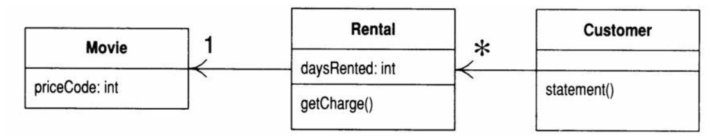

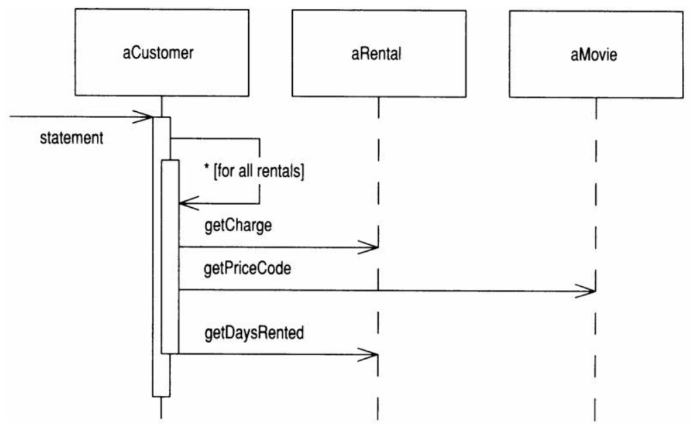

- Customer里头那个长长的statement()做的事情实在太多了，它做了很多原本应该由其他类完成的事情;

- statement()的这段代码里找出函数内的局部变量和参数。each和thisAmount，前者并未被修改，后者会被修改。临时变量往往引发问题，它们会导致大量参数被传来传去，而其实完全没有这种必要；

  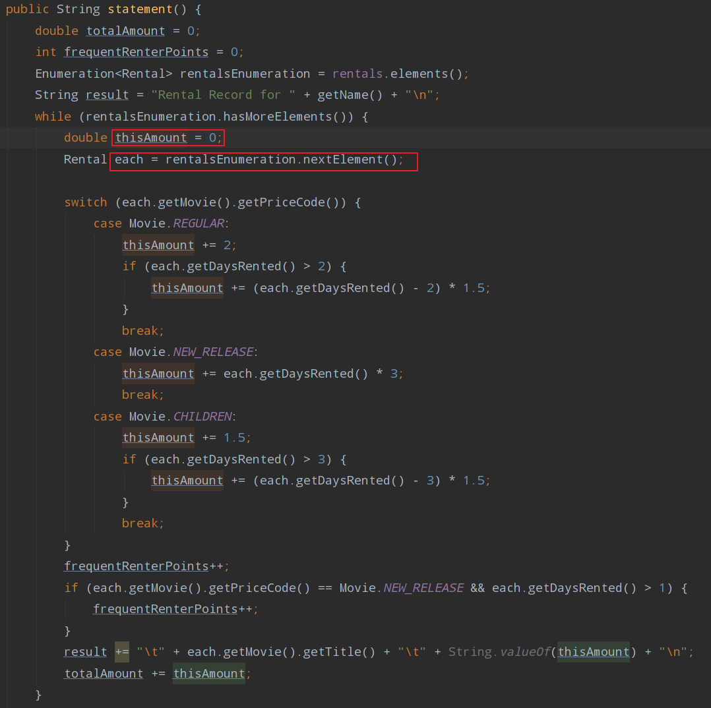

- 这个函数使用了来自Rental类的信息，却没有使用来自Customer类的信息，绝大多数情况下，函数应该放在它所使用的数据的所属对象内；

- 最好不要在另一个对象的属性基础上运用switch语句。如果不得不使用，也应该在对象自己的数据上使用，而不是在别人的数据上使用；

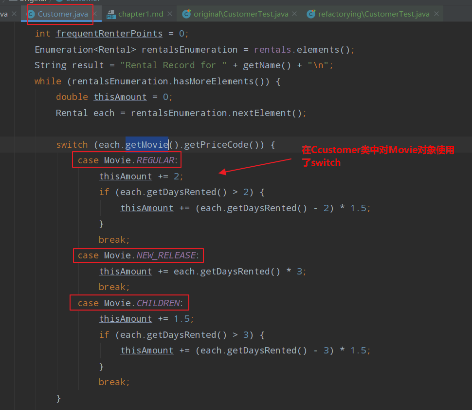

#### 2.2 进行重构

 [refactorying.Customer.java](refactorying\Customer.java) 

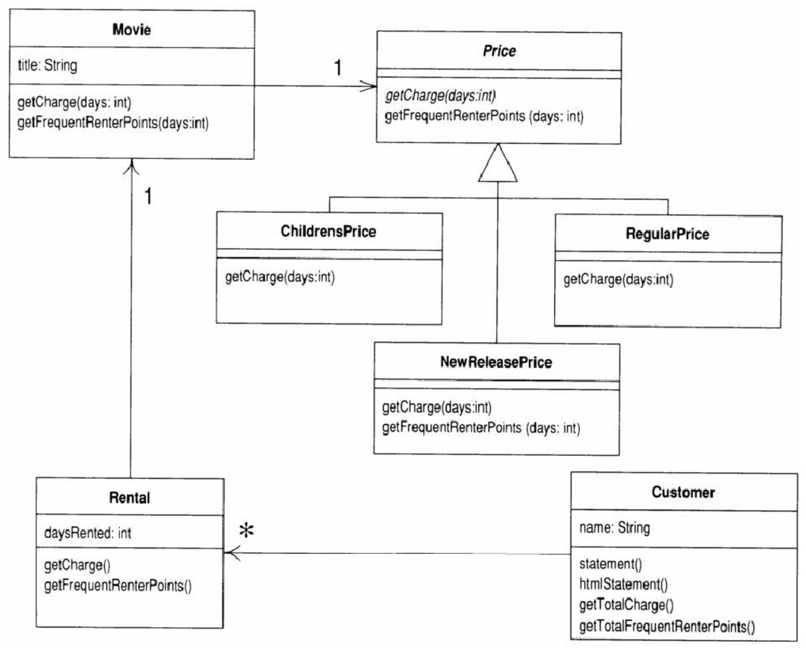

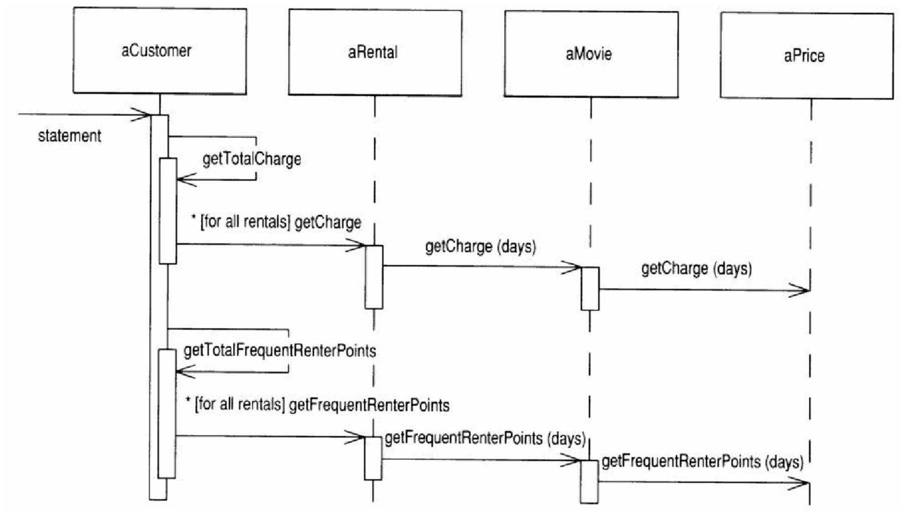

- 代码块越小，代码的功能就愈容易管理，代码的处理和移动也就越轻松，将计算金额和计算积分的部分移动到Movie类中；

   [Movie.java](refactorying\Movie.java) 

  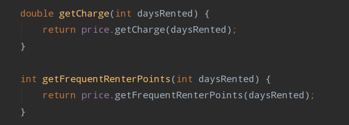

- 构存在另一个问题，那就是性能。但重构时你不必担心这些，优化时你才需要担心它们，但那时候你已处于一个比较有利的位置，有更多选择可以完成有效优化；

  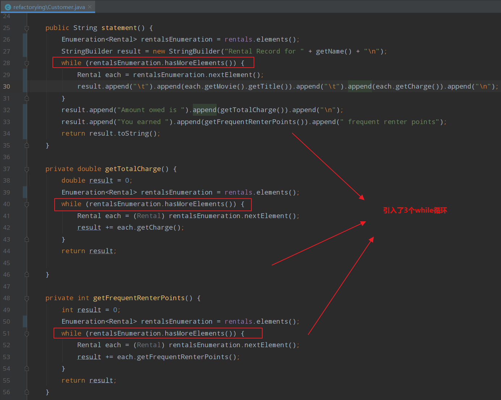

- 任何不会被修改的变量都可以被我当成参数传入新的函数，至于会被修改的变量就需格外小心。如果只有一个变量会被修改，我可以把它当作返回值；

  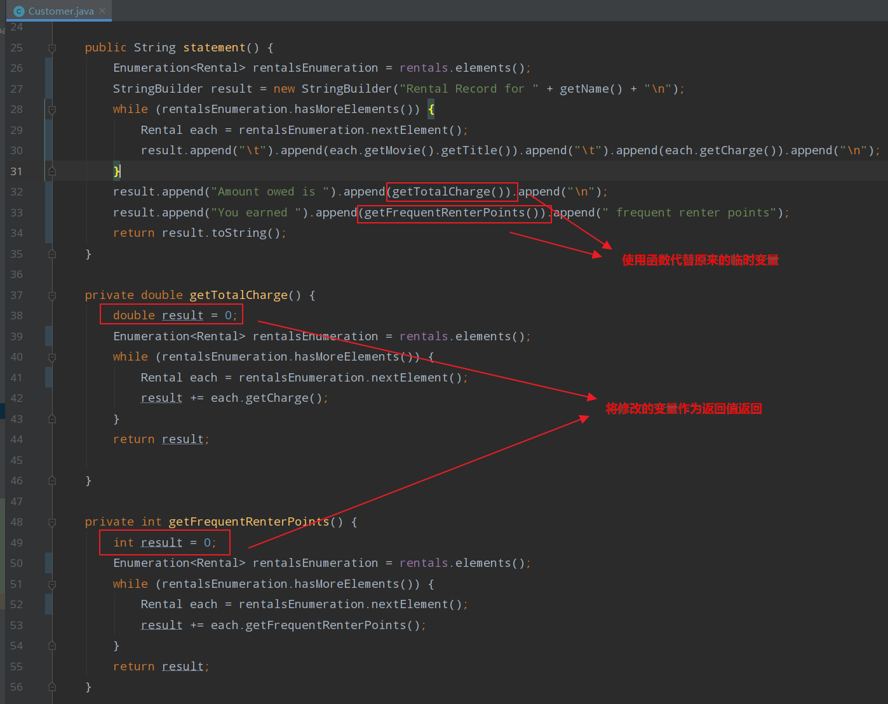

- 好的代码应该清楚表达出自己的功能，变量名称是代码清晰的关键；

- 计算费用时需要两项数据：租期长度和影片类型。为什么我选择将租期长度传给Movie对象，而不是将影片类型传给Rental对象呢？因为本系统可能发生的变化是加入新影片类型，这种变化带有不稳定倾向。

  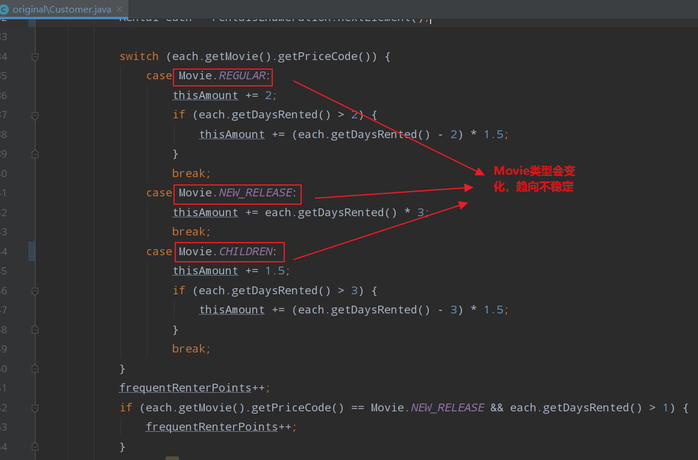

- 我就可以用多态来取代switch语句了；

  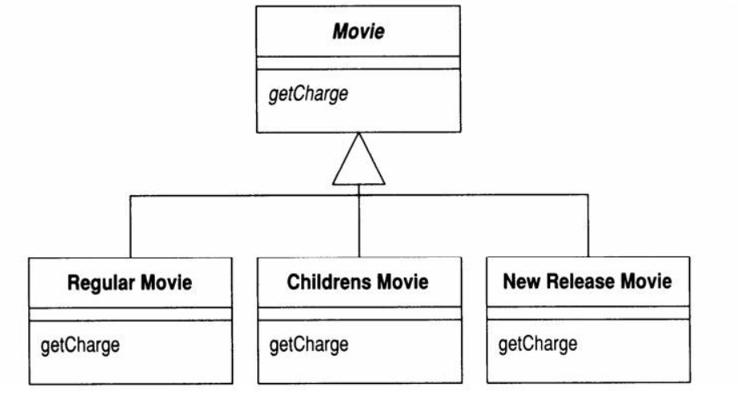

  - 这么一来，我就可以用多态来取代switch语句了。很遗憾的是这里有个小问题，不能这么干。一部影片可以在生命周期内修改自己的分类，一个对象却不能在生命周期内修改自己所属的类。不过还是有一个解决方法：State模式 。

    >个人理解对上句话的理解：Movie有多种属性，如名称、类别、价格等。如果生成了一个Movie对象，那么movie就只能被限定成RegularMovie、ChildrenMovie、NewReleaseMovie，而不能在对象的生命周期类，对其Movie type进行修改。

  

  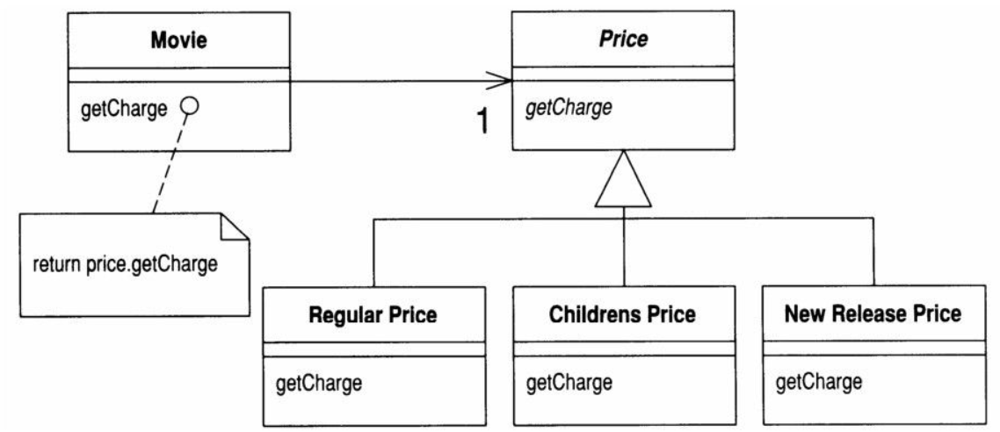

  

  - “这是一个State，还是一个Strategy?”答案取决于Price类究竟代表计费方式（此时我喜欢把它叫做Pricer还PricingStrategy），还是代表影片的某个状态（例如“Star Trek X是一部新片”）。

  - 引入State模式花了我不少力气，值得吗？这么做的收获是：如果我要修改任何与价格有关的行为，或是添加新的定价标准，或是加入其他取决于价格的行为，程序的修改会容易得多。

    > [设计模式之策略模式和状态模式（strategy pattern & state pattern）](https://www.cnblogs.com/yssjun/p/11116652.html)
    >
    >  [策略模式和状态模式的区别与对比](https://www.jianshu.com/p/578dcf292491)

### 3.小结

- 所有这些重构行为都使责任的分配更合理，代码的维护更轻松；

- 这个例子给我们最大的启发是重构的节奏：测试、小修改、测试、小修改、测试、小修改……正是这种节奏让重构得以快速而安全地前进。